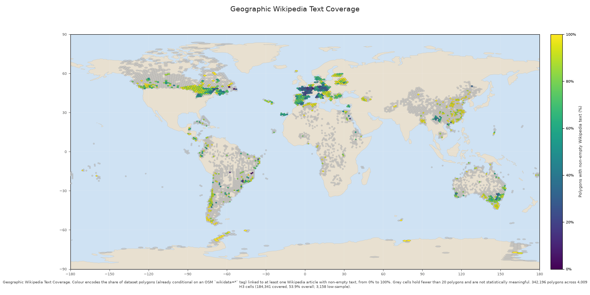
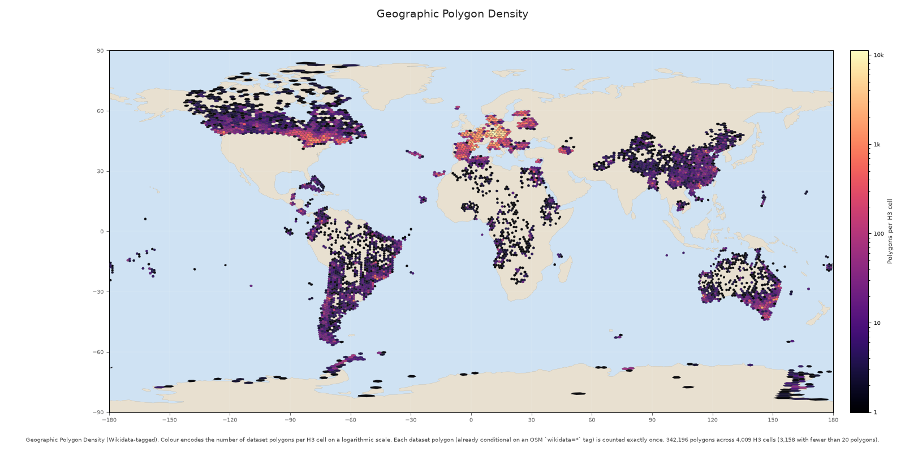

# osm-polygon-wikidata-only

Extract polygonal OpenStreetMap features carrying a `wikidata=*` tag
from Geofabrik `.osm.pbf` extracts, enrich them with Wikidata and
Wikipedia (articles per sitelink language, with revisions, license,
attribution), and publish the result as a clean, multi-table Hugging
Face dataset.

* **GitHub**: <https://github.com/NoeFlandre/osm-polygon-wikidata-only>
* **Hugging Face dataset**: <https://huggingface.co/datasets/NoeFlandre/osm-polygon-wikidata-only>
* **Maintainer**: Noé Flandre

Documentation: [architecture](docs/architecture.md) ·
[supported Python API](docs/api.md) · [development](docs/development.md) ·
[contributing](CONTRIBUTING.md) · [security](SECURITY.md)

---

## What this project does

1. Reads Geofabrik `.osm.pbf` files (country / region extracts).
2. Keeps only the polygonal elements:
   * **Closed ways** carrying a non-empty `wikidata=*` tag.
   * **Multipolygon relations** carrying a non-empty `wikidata=*` tag.
3. Computes geometry metadata per polygon (centroid via
   equirectangular projection, area in m² and km², bbox, area bucket,
   primary OSM tag).
4. Looks up the polygons' Wikidata QIDs (entity, sitelinks,
   descriptions) and then fetches each linked Wikipedia article
   (lead text, full plain text, page/revision ID, license,
   attribution).
5. Publishes the canonical region tables on the Hugging Face Hub:
   * `polygons/<stem>.parquet` — one row per polygon.
   * `wikipedia/documents/<stem>.parquet` — one row per unique Wikipedia article revision.
   * `polygon_articles/<stem>.parquet` — many-to-many polygon↔article links.
   * `manifests/processed_pbfs.json` — aggregate stats per source PBF.
6. Adds derived text and fact tables without reprocessing completed PBFs:
   * `wikipedia/sections/<stem>.parquet`.
   * `wikivoyage/documents/<stem>.parquet` and `wikivoyage/sections/<stem>.parquet`.
   * `wikidata/facts/<stem>.parquet`.

The repository is **code only**: every data artifact (PBFs, parquet,
HF caches, request caches) lives on an external drive.

---

## Repository layout

```
.
├── src/osm_polygon_wikidata_only/
│   ├── __init__.py
│   ├── augmentation/    # Wikipedia/Wikivoyage sections and Wikidata facts
│   ├── cli/             # Argument parsing and command adapters
│   ├── config/          # DataRoot paths and runtime Settings
│   ├── domain/          # Pure models, schemas, geometry, and identifiers
│   ├── enrichment/wikidata/ # Wikidata models, parsing, cache, and transport
│   ├── enrichment/wikipedia/ # Wikipedia models, parsing, cache, and transport
│   ├── hf/_dataset_stats/ # Dataset-card statistics internals
│   ├── hf/_geographic/    # Deterministic H3 visualizations
│   ├── hf/_uploader/      # Hub authorization and upload operations
│   ├── io/              # PBF, Parquet, manifests, cache, and atomic I/O
│   ├── pipeline/_wikidata_recovery/ # Audited, resumable repair internals
│   └── utils/           # JSON, logging, retries, time, and scheduling
├── tests/               # Unit, integration, contract, and golden tests
├── pyproject.toml       # Build, dev deps, ruff/mypy/pytest config
└── README.md
```

Each top-level sub-package has its own `__init__.py` and a tightly
focused public API. Cross-package imports go through dotted paths.

---

## Installation

Requires Python 3.12+ and [`uv`](https://docs.astral.sh/uv/).

```bash
git clone https://github.com/NoeFlandre/osm-polygon-wikidata-only.git
cd osm-polygon-wikidata-only
uv sync
```

This installs all runtime and development dependencies into a managed
`.venv`:

| Runtime | Purpose |
|---|---|
| `osmium` | Streaming OSM PBF parser |
| `datasets` | Hugging Face dataset utilities |
| `huggingface-hub` | HF Hub client |
| `pyarrow` | Parquet serialization |

| Dev | Purpose |
|---|---|
| `pytest`, `pytest-cov` | Tests |
| `ruff` | Lint + format |
| `mypy` | Type-check |

---

## External data root

All PBF inputs, intermediate outputs, Hugging Face caches, and the
local parquet/manifest files live on an external drive under a single
**data root**. The recommended local path is
`/Volumes/Seagate M3/projects/osm-polygon-wikidata-only/`.

Resolution order:

1. `--data-root <path>` CLI flag.
2. `OSM_POLYGON_DATA_ROOT` environment variable.
3. The recommended local path above, when it exists.

A data root that does not exist is rejected (no silent fallback).

Default sub-directories under the data root:

| Sub-directory | Purpose |
|---|---|
| `raw/` | Geofabrik `.osm.pbf` files (input) |
| `processed/polygons/` | Written `polygons/<stem>.parquet` files |
| `processed/articles/` | Local legacy staging files, retained only until their verified canonical publication succeeds |
| `processed/wikipedia/documents/` | Canonical Wikipedia documents |
| `processed/polygon_articles/` | Written `polygon_articles/<stem>.parquet` files |
| `processed/manifests/` | `processed_pbfs.json` aggregate manifest |
| `logs/` | Reserved for pipeline logs |
| `hf_cache/` | Hugging Face client-side cache |
| `cache/wikidata/`, `cache/wikipedia/` | Per-call JSON cache |
| `cache/` | Shared cache root |

Set the data root for a session:

```bash
export OSM_POLYGON_DATA_ROOT=/Volumes/Seagate\ M3/projects/osm-polygon-wikidata-only
```

---

## Usage

After `uv sync`, the processing and augmentation commands are:

```bash
uv run osm-polygon-wikidata-only sync-dir <dir> [--options]
uv run osm-polygon-wikidata-only process-pbf <input.pbf> [--options]
uv run osm-polygon-wikidata-only process-dir  <dir>     [--options]
uv run osm-polygon-wikidata-only augment-region <stem>  [--options]
uv run osm-polygon-wikidata-only augment-dir             [--options]
```

### Common options

| Flag | Purpose |
|---|---|
| `--data-root <path>` | Override the resolved external data root |
| `--repo-id <org/name>` | Target Hugging Face repo (default `NoeFlandre/osm-polygon-wikidata-only`) |
| `--user-agent <ua>` | Override Wikimedia User-Agent (default identifies this project) |
| `--languages en,fr,...` | Explicitly narrow the default all-language sitelink set |
| `--all-languages` | Explicit compatibility alias for the all-language default |
| `--no-full-text` | Fetch only the lead section, not the full article |
| `--max-articles-per-qid <n>` | Explicitly cap articles per QID (default: no cap) |
| `--enrichment-batch-size <n>` | Maximum QIDs/titles per API batch (default `50`) |
| `--enrichment-site-workers <n>` | Concurrent Wikipedia batch jobs (default `8`) |
| `--limit <n>` | Process only the first N polygons per PBF |
| `--skip-existing` | Skip PBFs already listed in the manifest |
| `--force` | Re-process even when `--skip-existing` applies |
| `--push` | Upload produced artifacts to the Hub |
| `--upload-threads <n>` | Concurrent transfer workers in the atomic Hub commit (default `5`) |
| `--commit-message <msg>` | Custom git commit message for the push |
| `--dry-run` | Use a stub HF client (records calls without uploading) |
| `--log-level <level>` | `DEBUG` / `INFO` / `WARNING` / `ERROR` |

### Examples

Process one PBF and write 3 parquet files + manifest locally:

```bash
uv run osm-polygon-wikidata-only process-pbf ~/pbfs/monaco-latest.osm.pbf
```

Push the result to the Hub with a stub client (no network):

```bash
uv run osm-polygon-wikidata-only process-pbf monaco-latest.osm.pbf --push --dry-run
```

Process every PBF under `<data-root>/raw/`, fetch only English and
French Wikipedia, skip already-processed:

```bash
uv run osm-polygon-wikidata-only process-dir \
    ~/pbfs/ \
    --languages en,fr \
    --skip-existing
```

### Wikimedia Bot Password authentication

Long production runs should authenticate their read-only API requests with a
Wikimedia Bot Password. Authentication identifies the pipeline to Wikimedia
and lets the account receive its applicable API request tier. It does not grant
this project permission to edit Wikimedia.

Create the credentials once:

1. Sign in to the Wikimedia account that will operate the pipeline.
2. Open [Meta-Wiki Special:BotPasswords](https://meta.wikimedia.org/wiki/Special:BotPasswords).
3. Enter a descriptive bot name such as `osm-polygon-pipeline`.
4. Select **Basic rights**, which are required for API reading. Leave editing,
   page creation, uploading, and administration grants disabled; this pipeline
   only reads public API data.
5. Create the Bot Password and copy both generated values immediately. The
   username includes a suffix, for example `AccountName@osm-polygon-pipeline`;
   use the complete generated username, not the main account username.

Export them into the current terminal session. Reading the password silently
keeps it out of shell history:

```bash
export WIKIMEDIA_BOT_USERNAME='AccountName@osm-polygon-pipeline'
read -rs WIKIMEDIA_BOT_PASSWORD
export WIKIMEDIA_BOT_PASSWORD
```

Paste the generated password at the silent prompt and press Enter. Do not commit
the password, add it to a checked-in `.env` file, paste it into an issue, or use
the main Wikimedia account password. The process retains it only in memory.

With both variables present, the unified pipeline uses the authenticated
1,200-request-per-minute budget with one shared scheduler and at most eight requests in flight
(anonymous runs default to three). To choose a different authenticated ceiling:

```bash
export WIKIMEDIA_REQUESTS_PER_MINUTE=600
```

Usually, omit this override and let the adaptive scheduler work. Wikimedia
determines the actual tier from the account's standing: authentication alone
does not guarantee a particular limit. The pipeline keeps at most eight requests
in flight for authenticated runs, keeps cookies domain-scoped in one bounded persistent connection pool,
and automatically reduces its rate when Wikimedia returns HTTP 429 with
`Retry-After`.

The startup log states either `anonymous` or `authenticated as <username>` and
the configured ceiling. The password is never logged. Authentication itself is
verified lazily on the first request to each Wikidata or language-Wikipedia host.
If only one credential variable is set, configuration stops before processing;
if Wikimedia rejects the pair, the first API request fails without silently
falling back to anonymous access.

Troubleshooting:

- If the application names a missing variable, export both variables in the same
  terminal that launches `uv run`.
- If authentication is rejected, copy the complete generated bot username,
  reset or recreate the Bot Password, and export the new values. Changing the
  main account password can require resetting Bot Passwords.
- If HTTP 429 responses continue, leave the automatic cooldown in control or
  lower `WIKIMEDIA_REQUESTS_PER_MINUTE`; do not override the concurrency limit
  without measuring the result.
- To revoke access, return to
  [Special:BotPasswords](https://meta.wikimedia.org/wiki/Special:BotPasswords)
  and revoke the named Bot Password. Then remove the variables with
  `unset WIKIMEDIA_BOT_USERNAME WIKIMEDIA_BOT_PASSWORD`.

The implementation follows Wikimedia's official
[Bot Password](https://www.mediawiki.org/wiki/Manual:Bot_passwords),
[API login](https://www.mediawiki.org/wiki/API:Login), and
[API rate-limit](https://www.mediawiki.org/wiki/Wikimedia_APIs/Rate_limits)
guidance.

### Resumable full-dataset command

Run this single command to reconcile the existing augmentation backlog, repair
remotely missing finalized artifacts without refetching them, process missing
PBFs, immediately augment them, and publish complete regional bundles:

```bash
uv run osm-polygon-wikidata-only sync-dir "$OSM_POLYGON_DATA_ROOT/raw" \
  --skip-existing \
  --push
```

`process-dir` and `augment-dir` remain available as compatibility commands, but
do not run them beside `sync-dir`. A data-root lock prevents duplicate unified
runs. Each completed region is uploaded atomically with fresh manifests and the
canonical dataset `README.md`. Internally the unified sync drains actions in
this order: RECOVERY first for finalized shards eligible for an exhaustive
local integrity audit (only affected QIDs are refetched and repaired transactionally),
then AUGMENT backlog (each call performs Wikimedia sidecar work
and may enqueue an atomic remote publication on success), then PUBLISH-only
reconciliation repairs (Wikimedia-free -- each repair reuses the already-loaded
local augmentation result and only enqueues a Hugging Face upload, with no
extraction and no Wikidata / Wikipedia / Wikivoyage calls), then new core
PROCESS work (the runner may prefetch the next PBF concurrently while
enriching the current region), then COMPLETE / no-op states. Maps and the
README are only reported "refreshed" after a successful core or metadata
publication actually refreshed them and the background upload queue has
drained.

The recovery audit is resumable, content-addressed, and processed one region at
a time. Healthy finalized regions store or reuse a receipt and continue; a
damaged region is repaired and published immediately before the next region is
audited. Stopping the command therefore preserves completed regional work,
while changed inputs are checked again. A malformed or unreadable finalized
shard fails closed instead of being silently skipped. Regions with incomplete
sidecars are augmented first and audited immediately afterward in the same
invocation. A repaired region is published atomically with its regional
artifacts, manifests, and dataset card. Coverage maps are regenerated only
when the repair changed one of their polygon, link, or document inputs.
Legacy Wikidata fact rows whose subject is no longer present in the region's
polygons are removed by that same transaction; all still-joinable facts are
preserved.
The command reports bounded local-scan and upstream-validation checkpoints with
elapsed time; transient Wikimedia API states such as `maxlag` remain retryable
and never become cached missing entities.

Affected relationships are repaired in deterministic groups of 25 QIDs. Up to
three independent groups run concurrently under the same shared global and
per-host Wikimedia scheduler. Each completed group is stored immediately below
`cache/wikidata_recovery/checkpoints/<stem>/<plan-hash>/`, so an interruption
repeats only unfinished groups. The final regional Parquet files and manifests
are still replaced atomically only after every group has completed.

Known whole-file Geofabrik containment overlaps are retired safely during
`sync-dir --push`: retained parents receive missing sidecar rows, contained
child artifacts are removed remotely in one atomic commit, and local originals
are preserved under `quarantine/containment-v1/`. A child PBF is ignored only
after the durable retirement manifest records local preparation; a missing
parent polygon blocks retirement rather than discarding data.

To pause, stop the command with `Ctrl-C`. Run the identical command again to
resume: completed PBFs remain skipped, while the interrupted PBF is retried
because it has no completed manifest entry. The durable pending-publications
manifest and the upload-queue state files persist across restarts, so a
failed upload is always retryable on the next invocation. Stage timings are
logged for every PBF. Tune large runs only when needed with
`--enrichment-batch-size`, `--enrichment-site-workers`, and `--upload-threads`.

The normal command fetches full text for every valid language-Wikipedia
sitelink with no per-QID cap. If any expected article remains unresolved after
retries, that PBF is not published; rerunning resumes from successful cache
checkpoints. With `--push`, each locally complete PBF is queued for an atomic
background upload while the next PBF starts processing. Shutdown waits for the
queue, and unresolved uploads make the command exit nonzero and remain queued
for the next invocation.

Programmatic usage:

```python
from pathlib import Path
from osm_polygon_wikidata_only.config.paths import DataRoot, resolve_data_root
from osm_polygon_wikidata_only.config.settings import Settings
from osm_polygon_wikidata_only.enrichment.wikipedia_client import HttpWikipediaClient
from osm_polygon_wikidata_only.enrichment.wikidata_client import HttpWikidataClient
from osm_polygon_wikidata_only.pipeline.processor import process_pbf

data_root = resolve_data_root(repo_root=Path.cwd())
data_root.ensure()

settings = Settings(languages=("en", "fr"))
wd = HttpWikidataClient(settings)
wiki = HttpWikipediaClient(settings)

result = process_pbf(
    Path("monaco-latest.osm.pbf"),
    data_root=data_root,
    wikidata_client=wd,
    wikipedia_client=wiki,
    settings=settings,
)
print(result.polygon_count, "polygons")
```

## Reliability and performance behavior

The pipeline is designed to preserve dataset completeness while keeping
Wikimedia traffic polite:

* Candidate order, selected sitelinks, and Parquet row ordering are
  deterministic.
* Identical Wikidata QIDs and Wikipedia titles are fetched once per run and
  reused for every matching polygon.
* HTTP clients use the on-disk cache by default. Failed requests are cached
  briefly to avoid repeatedly hammering a failing endpoint.
* Concrete HTTP clients batch compatible Wikidata and same-language Wikipedia
  requests. The pipeline falls back to the established per-item request path
  if a batch response is incomplete or invalid.
* If a valid page returns an empty TextExtracts result, the client parses that
  page's exact revision through the Action API and converts the rendered HTML
  to plain text while preserving the original revision ID.
* Per-host pacing, retries with jitter, and a shared `429` cooldown remain in
  force when batch jobs run concurrently.
* Long enrichment stages emit a concise two-minute heartbeat naming the active
  Wikidata or Wikipedia phase, completed and total QIDs, completed and total
  Wikipedia sites, and articles attempted. The snapshot confirms liveness; it is
  not an ETA and does not change request pacing. Short enrichment stages finish
  without a heartbeat.
* `--push` publishes every produced Parquet artifact and the final manifest in
  one atomic Hugging Face commit. Transfers use concurrent workers; increase
  `--upload-threads` only when local bandwidth and Hub quotas allow it.

For a repeatable production run, use `--skip-existing`; it consults the
manifest and leaves previously completed PBFs untouched. Use `--force` only
when you intentionally want to rebuild a completed PBF.

## Development quality checks

Run the complete local gate before contributing:

```bash
uv run pytest -q
uv run ruff check .
uv run ruff format --check .
uv run mypy src
```

The test suite uses in-memory clients and stub PBF readers for unit coverage.
It does not require a real PBF, external data root, or Wikimedia request.

---

## Output schema

Each PBF produces polygon and link tables plus canonical Wikipedia
documents and the derived text/fact tables. The schema
definitions live in `osm_polygon_wikidata_only.domain.schema` and
`osm_polygon_wikidata_only.augmentation.schema` so the dataset
card, the parquet writers, and the tests share a single source of
truth.

### `polygons/<stem>.parquet`

One row per polygon. Includes geometry metadata, OSM tags, primary
OSM tag, area bucket, and Wikipedia coverage counters.

### `wikipedia/documents/<stem>.parquet`

One row per unique Wikipedia article
(`(wikidata, language, page_id, revision_id)`). Includes lead text,
plain-text full text, thumbnails, license, attribution, and a
deterministic SHA-256 `content_hash`. It preserves every field from
the former `articles/` table and adds stable `document_id` and
`project` fields. The legacy remote `articles/` path is deleted in
the same atomic Hub commit as the canonical upload; the local
`processed/articles/` staging file is removed only after confirmed
publication and reference validation.

### `polygon_articles/<stem>.parquet`

Many-to-many links joining polygons to articles, plus a boolean
`is_best_language` flag (true for the language chosen by
`LinkSummary.best_language()`).

### `manifests/processed_pbfs.json`

Aggregate stats per source PBF: polygon/article counts, language
coverage, area-bucket counts, top tag keys.

### Derived text and fact tables

Text sections, Wikivoyage documents, and Wikidata facts are published
when augmentation has run for a region. Wikipedia sections reference
the canonical document IDs; retiring the legacy article table never
removes or rewrites section content.

- `wikipedia/documents/<stem>.parquet` and `wikipedia/sections/<stem>.parquet`
- `wikivoyage/documents/<stem>.parquet` and `wikivoyage/sections/<stem>.parquet`
- `wikidata/facts/<stem>.parquet`

Column lists for documents, sections, and facts live in
`osm_polygon_wikidata_only.augmentation.schema` (`DOCUMENT_COLUMNS`,
`SECTION_COLUMNS`, `FACT_COLUMNS`) and the documented column
descriptions live in
`osm_polygon_wikidata_only.augmentation.schema_descriptions`. The
generated Hugging Face dataset card (`README.md`) embeds every
augmentation column with its description; the dataset card renderer
is the source of truth for what's published.

## Generated dataset card

The published dataset card on the Hugging Face Hub is regenerated
automatically before every publication path. It reports factual
core, Wikipedia, Wikivoyage, section, and Wikidata-fact statistics
computed directly from the local finalized Parquet files under
`<processed>/`. No hardcoded counts live in the source repository
or the generated card; every figure is recomputed on each
publication.

The canonical renderer is `osm_polygon_wikidata_only.hf.publication.write_readme_snapshot`,
backed by `osm_polygon_wikidata_only.hf.dataset_stats.render_stats_section`
and `osm_polygon_wikidata_only.hf.dataset_card.render_dataset_card`.
The renderer pulls both the core `DatasetStats` snapshot and the
private augmentation snapshot from the local sidecars.

---

## Geographic coverage

Both maps below aggregate dataset polygons into H3 cells at the same
resolution. All denominators and counts are conditional on each polygon
carrying an OSM `wikidata=*` tag.

### Wikipedia text coverage



`coverage_rate(h) = covered_polygons(h) / all_dataset_polygons(h)`,
where a covered polygon has at least one linked Wikipedia article with
non-empty text. Cell colour encodes this fraction from 0% to 100%; grey
cells hold fewer than 20 polygons and are not statistically meaningful.

### Polygon density



`polygon_count(h) = number of dataset polygons whose centroid belongs
to H3 cell h`. Colour encodes the raw count on a logarithmic scale
because counts are highly skewed across the world. Low counts remain
visible.

---

## Wikimedia etiquette

Wikimedia APIs require a User-Agent identifying the project and a
contact. The defaults are in `config.settings.DEFAULT_USER_AGENT`.
Set `--user-agent` in production deployments.

The HTTP clients honor:

* configurable `request_timeout_s`, `request_max_retries`,
  `request_base_delay_s`,
* exponential backoff with jitter (`utils.retry.with_retries`),
* a disk-backed `JsonFileCache` (`io.cache.JsonFileCache`) that lets
  repeated runs avoid hammering the same endpoint,
* localized language lists (`--languages`) so we never fetch
  unwanted sitelinks.

For authenticated production processing, follow the
[Bot Password setup](#wikimedia-bot-password-authentication). Bot Password
cookies are kept in memory and isolated per Wikimedia API host. Anonymous mode
remains available when neither credential environment variable is set.

---

## Development

### Run the tests

```bash
uv run pytest
```

The 1,300+ tracked tests are deterministic and require no live network;
HTTP clients come in three flavors (`Http…`, `InMemory…`,
`Cached…`) and the tests use the in-memory flavors.

### Lint and format

```bash
uv run ruff check .
uv run ruff format .
```

### Type-check

```bash
uv run mypy src
```

---

## Repository / data separation policy

The repository is **code-only**. Everything user-generated (datasets,
HF caches, Arrow/Parquet files, downloaded PBFs) is git-ignored and
must live on the configured external data root. This keeps the repo
tiny, makes data updates cheap, and prevents accidental commits of
multi-GB artifacts.

---

## Licensing and attribution

* **OpenStreetMap polygons**: (c) OpenStreetMap contributors, licensed
  under [ODbL 1.0](https://opendatacommons.org/licenses/odbl/).
* **Wikidata** entity data: (c) Wikimedia contributors under
  [CC0 1.0](https://creativecommons.org/publicdomain/zero/1.0/).
* **Wikipedia** article text: (c) respective Wikipedia authors,
  licensed under
  [CC BY-SA 4.0](https://creativecommons.org/licenses/by-sa/4.0/).
  Attribution and license are stored inline in the
  `wikipedia/documents/<stem>.parquet` `license` and `attribution`
  columns.

Any derivative dataset must preserve OSM attribution as described on
<https://www.openstreetmap.org/copyright>.
