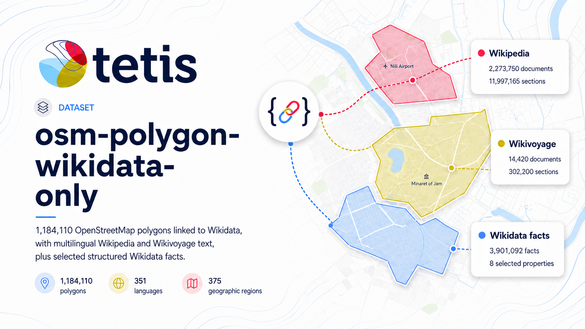
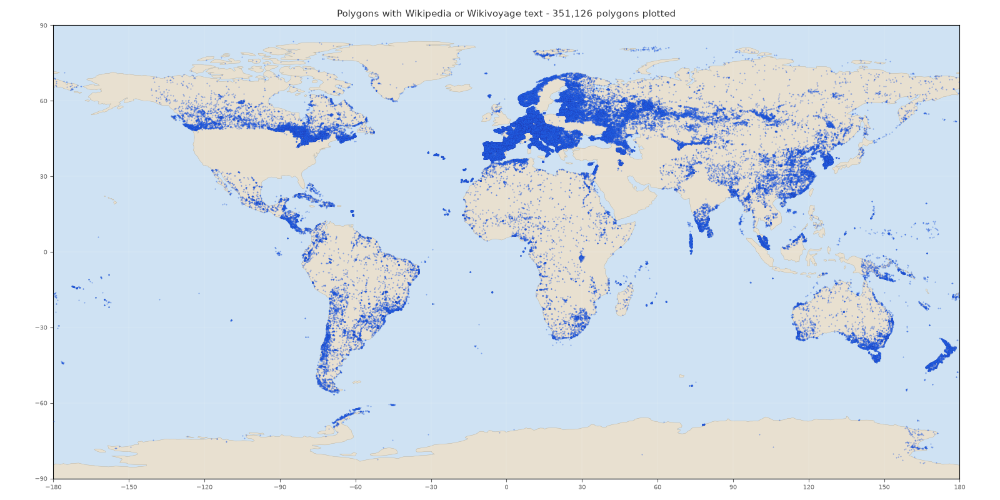
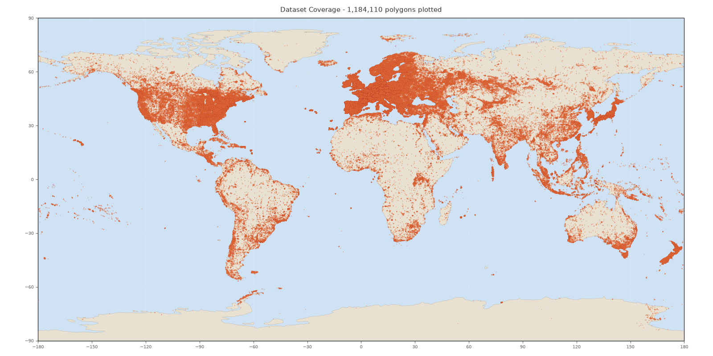
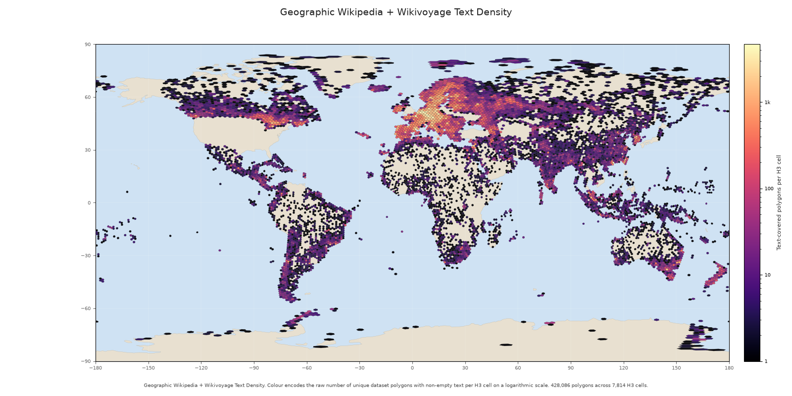

# osm-polygon-wikidata-only



V1 blog post: [How to describe a place on Earth with Wikidata](https://noeflandre.com/posts/describe-place-on-earth-part1-wikidata).

Extract polygonal OpenStreetMap features from Geofabrik `.osm.pbf` extracts,
enrich them with Wikidata, Wikipedia, and Wikivoyage, and publish clean,
multi-table Hugging Face datasets. The default V1 contract is Wikidata-first;
the explicit V2 contract also keeps polygons discovered through valid
multilingual `wikipedia=*` tags, including polygons without a Wikidata QID.

* **GitHub**: <https://github.com/NoeFlandre/osm-polygon-wikidata-only>
* **V1 Hugging Face dataset**: <https://huggingface.co/datasets/NoeFlandre/osm-polygon-wikidata-only>
* **V2 Hugging Face dataset**: <https://huggingface.co/datasets/NoeFlandre/osm-polygon-wikidata-and-wikipedia>
* **Documentation**: <https://noeflandre.github.io/osm-polygon-wikidata-only/>
* **Maintainer**: Noé Flandre

The first Hugging Face dataset is **V1**, produced by the
[V1.0.0 GitHub code](https://github.com/NoeFlandre/osm-polygon-wikidata-only/tree/v1.0.0).
The V2 Hugging Face dataset is produced by the
[V2.0.0 GitHub release](https://github.com/NoeFlandre/osm-polygon-wikidata-only/releases/tag/v2.0.0).

## Dataset versions

| Version | Dataset and code | Scope | Snapshot |
| --- | --- | --- | --- |
| **V1** | [Hugging Face dataset](https://huggingface.co/datasets/NoeFlandre/osm-polygon-wikidata-only) · [GitHub `v1.0.0`](https://github.com/NoeFlandre/osm-polygon-wikidata-only/tree/v1.0.0) | Wikidata-first polygons | 1,184,110 polygons · 2,288,170 Wikipedia + Wikivoyage documents · 351 languages · 375 regions |
| **V2** | [Hugging Face dataset](https://huggingface.co/datasets/NoeFlandre/osm-polygon-wikidata-and-wikipedia) · [GitHub `v2.0.0`](https://github.com/NoeFlandre/osm-polygon-wikidata-only/releases/tag/v2.0.0) | V1 plus valid multilingual `wikipedia=*` references, including polygons without Wikidata | 1,259,424 polygons · 2,332,127 Wikipedia + Wikivoyage documents · 353 languages · 386 regions |

## Trackio snapshot (V1)

[View the dataset presentation](https://noeflandre.github.io/osm-polygon-wikidata-only/presentations/dataset.html)
for a visual overview of the published tables and geographic coverage.
[View the codebase presentation](https://noeflandre.github.io/osm-polygon-wikidata-only/presentations/codebase.html)
for a visual overview of the architecture and implementation.

The finished dataset is recorded in the single public Trackio run
[`final-dataset-snapshot`](https://huggingface.co/spaces/NoeFlandre/osm-polygon-wikidata-only-trackio).
It contains exactly three plots: a text-coverage funnel, the top ten Wikipedia
languages plus `Other languages`, and dataset composition on a logarithmic scale.
The run is a static snapshot with no pipeline timeline.

| Snapshot metric | Value |
| --- | ---: |
| Polygons | 1,184,110 |
| Wikipedia + Wikivoyage documents | 2,288,170 |
| Document words | 801,528,334 |
| Languages | 351 |
| Geographic regions | 375 |

| Small snapshot table | Value |
| --- | ---: |
| Wikipedia polygon-document links | 2,468,604 |
| Polygon/link-table storage | 9.9 GB |
| Total Parquet storage | 19.2 GB |

The funnel's language thresholds use the canonical Wikipedia polygon fields.
Wikivoyage is included in the combined document, word, and dataset-composition totals.

Documentation: [architecture](docs/architecture.md) ·
[supported Python API](docs/api.md) · [development](docs/development.md) ·
[contributing](CONTRIBUTING.md) · [security](SECURITY.md)

---

## What this project does

1. Reads Geofabrik `.osm.pbf` files (country / region extracts).
2. Keeps only the polygonal elements:
   * **Closed ways** carrying a non-empty `wikidata=*` tag.
   * **Multipolygon relations** carrying a non-empty `wikidata=*` tag.
3. Computes geometry metadata per polygon (centroid via
   equirectangular projection, area in m² and km², bbox, area bucket,
   primary OSM tag).
4. Looks up the polygons' Wikidata QIDs (entity, sitelinks,
   descriptions) and then fetches each linked Wikipedia article
   (lead text, full plain text, page/revision ID, license,
   attribution).
5. Publishes the canonical region tables on the Hugging Face Hub:
   * `polygons/<stem>.parquet` — one row per polygon.
   * `wikipedia/documents/<stem>.parquet` — one row per unique Wikipedia article revision.
   * `polygon_articles/<stem>.parquet` — unified many-to-many
     polygon↔document links for Wikipedia and Wikivoyage.
   * `manifests/processed_pbfs.json` — aggregate stats per source PBF.
6. Adds text and fact tables without reprocessing completed PBFs:
   * `wikipedia/sections/<stem>.parquet` — section-level Wikipedia text.
   * `wikivoyage/documents/<stem>.parquet` — full Wikivoyage documents.
   * `wikivoyage/sections/<stem>.parquet` — section-level Wikivoyage text.
   * `wikidata/facts/<stem>.parquet` — structured claims for polygon entities.
7. Publishes one frozen Trackio run with static dataset metrics and three plots.

V2 is an explicit, isolated workflow. It starts from finalized V1 artifacts,
scans each source PBF for direct Wikipedia tags, reuses matching V1 documents,
fetches only missing direct pages, and writes under `processed_v2/`. It uses a
unified `polygon_document_links/` table with `link_sources` provenance and
publishes to the separate V2 dataset above. V2 also writes
`wikipedia/sections/<stem>.parquet` with the exact V1 section schema, reusing
existing V1 rows and fetching only missing Wikipedia revisions. V1 files and the
default workflow are never rewritten by a V2 run. Its resumable indexes,
checkpoints, and fetched responses stay in the configured data root and are
never published. A restart rescans at most the source PBF because libosmium does
not expose a portable byte offset, while already saved extraction and fetch
work is reused and never published until final reconciliation.

---

## Repository layout

The source is organized into focused packages: `augmentation/`, `domain/`,
`enrichment/`, `io/`, `pipeline/`, `v2/`, `hf/`, `cli/`, and `utils/`.
Tests are under `tests/`; package, Ruff, ty, and pytest configuration is in
`pyproject.toml`. See [the architecture guide](docs/architecture.md) for
ownership boundaries and data flow.

---

## Installation

Requires Python 3.12+ and [`uv`](https://docs.astral.sh/uv/).

```bash
git clone https://github.com/NoeFlandre/osm-polygon-wikidata-only.git
cd osm-polygon-wikidata-only
uv sync
```

This installs the runtime and development dependencies into a managed
`.venv`; the complete toolchain is declared in `pyproject.toml` and
`uv.lock`.

### Reproducible Docker runtime

The repository also ships a non-root Docker image built from the locked
`uv.lock` environment. Build and smoke-test it without touching any dataset
data:

```bash
just docker-build
just docker-help
```

Mount a data root explicitly when running the resumable workflow. The
`docker-run` recipe builds (or reuses) the cached image, and the image's
default command is `--help`; no pipeline starts accidentally:

```bash
just docker-run /path/to/osm-polygon-data
```

`/path/to/osm-polygon-data` must contain `raw/`. The same mounted directory
stores checkpoints, caches, manifests, and generated artifacts, so stopping
and rerunning the command is safe. Credentials are supplied only through
`HF_TOKEN` and the documented Wikimedia environment variables; they are not
included in the image. See the [Docker reproducibility guide](docs/development.md#docker-reproducibility)
for the development test/check targets and mount contract.

---

## Local data root

The CLI requires an operator-selected **data root** for PBF inputs,
intermediate Parquet files, manifests, and caches. Set it with the
`--data-root` option or `OSM_POLYGON_DATA_ROOT`; it must already exist and
must not be inside the source checkout.

```bash
export OSM_POLYGON_DATA_ROOT=/path/to/osm-polygon-data
```

---

## Usage

After `uv sync`, the processing and augmentation commands are:

```bash
uv run osm-polygon-wikidata-only sync-dir <dir> [--options]
uv run osm-polygon-wikidata-only process-pbf <input.pbf> [--options]
uv run osm-polygon-wikidata-only process-dir  <dir>     [--options]
uv run osm-polygon-wikidata-only augment-region <stem>  [--options]
uv run osm-polygon-wikidata-only augment-dir             [--options]
uv run osm-polygon-wikidata-only-trackio                 [--data-root <path>]
```

### Common options

| Flag | Purpose |
|---|---|
| `--data-root <path>` | Override the resolved external data root |
| `--repo-id <org/name>` | Target Hugging Face repo (default `NoeFlandre/osm-polygon-wikidata-only`) |
| `--user-agent <ua>` | Override Wikimedia User-Agent (default identifies this project) |
| `--languages en,fr,...` | Explicitly narrow the default all-language sitelink set |
| `--no-full-text` | Fetch only the lead section, not the full article |
| `--max-articles-per-qid <n>` | Explicitly cap articles per QID (default: no cap) |
| `--enrichment-batch-size <n>` | Maximum QIDs/titles per API batch (default `50`) |
| `--enrichment-site-workers <n>` | Concurrent Wikipedia batch jobs (default `8`) |
| `--limit <n>` | Process only the first N polygons per PBF |
| `--skip-existing` | Skip PBFs already listed in the manifest |
| `--force` | Re-process even when `--skip-existing` applies |
| `--push` | Upload produced artifacts to the Hub |
| `--upload-threads <n>` | Concurrent transfer workers in the atomic Hub commit (default `5`) |
| `--dataset-version v1|v2` | Select the sync contract; V2 is opt-in and publishes to its separate Hub dataset |

### Examples

Process one PBF and write 3 parquet files + manifest locally:

```bash
uv run osm-polygon-wikidata-only process-pbf ~/pbfs/monaco-latest.osm.pbf
```

Build the isolated V2 dataset. This keeps V1 artifacts intact, reuses their
finalized documents and sidecars, and fetches only direct Wikipedia-tag pages
that are not already present in V1:

```bash
uv run osm-polygon-wikidata-only sync-dir \
    "$OSM_POLYGON_DATA_ROOT/raw" \
    --dataset-version v2 \
    --skip-existing \
    --push
```

V2 writes below `processed_v2/` and keeps its reuse index and restart
checkpoints in the configured data root. It reuses finalized V1 documents and
sections, fetches only missing direct pages, and keeps V1 files unchanged.
Extraction, fetching, and publication are checkpointed so an interrupted run
can resume; use `--force` only when deliberately rebuilding a region.

### Wikimedia Bot Password authentication

Long production runs should authenticate their read-only API requests with a
Wikimedia Bot Password. Authentication identifies the pipeline to Wikimedia
and lets the account receive its applicable API request tier. It does not grant
this project permission to edit Wikimedia.

Create a Bot Password with Basic rights at
[Meta-Wiki Special:BotPasswords](https://meta.wikimedia.org/wiki/Special:BotPasswords).
Use the complete generated username, including its suffix.

Export them into the current terminal session. Reading the password silently
keeps it out of shell history:

```bash
export WIKIMEDIA_BOT_USERNAME='AccountName@osm-polygon-pipeline'
read -rs WIKIMEDIA_BOT_PASSWORD
export WIKIMEDIA_BOT_PASSWORD
```

Paste the generated password at the silent prompt. Do not commit it, add it to
a checked-in `.env` file, paste it into an issue, or use the main account
password.

With both variables present, the unified pipeline uses the authenticated
1,200-request-per-minute budget with one shared scheduler and at most twelve
requests in flight (anonymous runs default to three). To choose a different
authenticated ceiling:

```bash
export WIKIMEDIA_REQUESTS_PER_MINUTE=600
```

Usually omit this override and let the adaptive scheduler work. The startup log
reports the mode and ceiling, the password is never logged, authenticated runs
keep at most twelve requests in flight, and HTTP 429 responses trigger a
cooldown. To revoke access, remove the variables and revoke the named Bot
Password at [Special:BotPasswords](https://meta.wikimedia.org/wiki/Special:BotPasswords).

### Resumable full-dataset command

Run this single command to reconcile the existing augmentation backlog, repair
remotely missing finalized artifacts without refetching them, process missing
PBFs, immediately augment them, and publish complete regional bundles:

```bash
uv run osm-polygon-wikidata-only sync-dir "$OSM_POLYGON_DATA_ROOT/raw" \
  --skip-existing \
  --push
```

`process-dir` and `augment-dir` remain available, but should not run beside
`sync-dir`. Completed regions are uploaded atomically with fresh manifests and
the canonical dataset card. The runner prioritizes recovery, augmentation,
publication repairs, and then new PBF processing; maps and the README are
reported refreshed only after a successful publication.

Recovery is resumable and fail-closed. Affected relationships are repaired in
deterministic groups of 25 QIDs. Completed groups remain in local resumable
state, and a restart repeats only unfinished groups while keeping completed
regional work.

To pause, stop the command with `Ctrl-C`. Run the identical command again to
resume: completed PBFs remain skipped, while the interrupted PBF is retried
because it has no completed manifest entry. The durable pending-publications
manifest and the upload-queue state files persist across restarts, so a
failed upload is always retryable on the next invocation. Stage timings are
logged for every PBF. Tune large runs only when needed with
`--enrichment-batch-size`, `--enrichment-site-workers`, and `--upload-threads`.

The normal command fetches full text for every valid language-Wikipedia sitelink
with no per-QID cap. Unresolved articles prevent publication until a retry
succeeds; with `--push`, completed regions are queued for atomic upload and
failed uploads remain retryable.

## Reliability and performance behavior

The pipeline is designed to preserve dataset completeness while keeping
Wikimedia traffic polite:

* Candidate order, selected sitelinks, and Parquet row ordering are
  deterministic.
* Identical Wikidata QIDs and Wikipedia titles are fetched once per run and
  reused for every matching polygon.
* HTTP clients use the on-disk cache by default. Failed requests are cached
  briefly to avoid repeatedly hammering a failing endpoint.
* Concrete HTTP clients batch compatible Wikidata and same-language Wikipedia
  requests. The pipeline falls back to the established per-item request path
  if a batch response is incomplete or invalid.
* Per-host pacing, retries with jitter, and a shared `429` cooldown remain in
  force when batch jobs run concurrently.
* Long enrichment stages emit a concise two-minute heartbeat naming the active
  Wikidata or Wikipedia phase, completed and total QIDs, completed and total
  Wikipedia sites, and articles attempted. The snapshot confirms liveness; it is
  not an ETA and does not change request pacing. Short enrichment stages finish
  without a heartbeat.
* `--push` publishes every produced Parquet artifact and the final manifest in
  one atomic Hugging Face commit. Transfers use concurrent workers; increase
  `--upload-threads` only when local bandwidth and Hub quotas allow it.

For a repeatable production run, use `--skip-existing`; it leaves completed
PBFs untouched. Use `--force` only when deliberately rebuilding one.

## Development quality checks

The project exposes the same uv-managed checks locally and in GitHub
Actions through `just`. Before completion, use:

```bash
just quality-gauntlet
```

Install the pre-commit hooks once per checkout:

```bash
uv run pre-commit install
```

The test suite uses in-memory clients and stub PBF readers for unit coverage.
It does not require a real PBF, external data root, or Wikimedia request.

For the read-only remote audit and the full development workflow, see
[`docs/development.md`](docs/development.md).

---

## Output schema

Each PBF produces polygon and link tables, canonical Wikipedia documents, and
the derived text/fact tables described below.

### `polygons/<stem>.parquet`

One row per polygon. Includes geometry metadata, OSM tags, primary
OSM tag, area bucket, and Wikipedia coverage counters.

### `wikipedia/documents/<stem>.parquet`

One row per unique Wikipedia article
(`(wikidata, language, page_id, revision_id)`). Includes lead text,
plain-text full text, thumbnails, license, attribution, and a
deterministic SHA-256 `content_hash`. It preserves every field from
the former `articles/` table and adds stable `document_id` and
`project` fields. The legacy remote `articles/` path is deleted in
the same atomic Hub commit as the canonical upload; local staging
files are removed only after confirmed publication and reference validation.

### `polygon_articles/<stem>.parquet`

Unified many-to-many links joining polygons to Wikipedia and Wikivoyage
documents. The `project` column identifies the source corpus and
`document_id` references the corresponding project document table.

### `manifests/processed_pbfs.json`

Aggregate stats per source PBF: polygon/article counts, language
coverage, area-bucket counts, top tag keys.

### Text and fact tables

Text sections, Wikivoyage documents, and Wikidata facts are published
when augmentation has run for a region. Wikipedia sections reference
the canonical document IDs; retiring the legacy article table never
removes or rewrites section content.

- `wikipedia/sections/<stem>.parquet` — section-level partitions of
  Wikipedia document text.
- `wikivoyage/documents/<stem>.parquet` — full Wikivoyage documents
  associated with places through Wikidata.
- `wikivoyage/sections/<stem>.parquet` — section-level partitions of
  Wikivoyage document text.
- `wikidata/facts/<stem>.parquet` — structured Wikidata claims for
  polygon entities.

The generated Hugging Face dataset card includes the published column
descriptions.

## Generated dataset card

The published dataset card on the Hugging Face Hub is regenerated
automatically before every publication path. It reports factual
core, Wikipedia, Wikivoyage, section, and Wikidata-fact statistics
computed directly from the local finalized Parquet files under
`<processed>/`. No hardcoded counts live in the source repository
or the generated card; every figure is recomputed on each
publication.

The canonical renderer is
`osm_polygon_wikidata_only.hf.publication.write_readme_snapshot`.

---

## Geographic coverage

### Polygons with Wikipedia or Wikivoyage text



Each point is a dataset polygon with at least one non-empty Wikipedia
document or a non-empty Wikivoyage document sharing its Wikidata entity.
A polygon is shown once even when several documents qualify.

### All dataset polygons



Each point represents one dataset polygon carrying an OSM `wikidata=*`
tag, whether or not corresponding Wikipedia or Wikivoyage text exists.

### Wikipedia + Wikivoyage text density



Each H3 cell contains the raw number of polygons with non-empty text
from Wikipedia or Wikivoyage. A polygon is counted once even when both
projects or several documents qualify. Colour uses a logarithmic
purple-to-yellow scale; this is an absolute density count, not a proportion
of all polygons.

---

## Development

### Run the tests

```bash
just test
```

The tracked test suite is deterministic and requires no live network;
HTTP clients come in three flavors (`Http…`, `InMemory…`,
`Cached…`) and the tests use the in-memory flavors.

Use `just --list` for the other recipes. All Python commands run through uv;
GitHub Actions runs the same complete `just quality-gauntlet` gate.

---

## Licensing and attribution

* **OpenStreetMap polygons**: (c) OpenStreetMap contributors, licensed
  under [ODbL 1.0](https://opendatacommons.org/licenses/odbl/).
* **Wikidata** entity data: (c) Wikimedia contributors under
  [CC0 1.0](https://creativecommons.org/publicdomain/zero/1.0/).
* **Wikipedia** article text: (c) respective Wikipedia authors,
  licensed under
  [CC BY-SA 4.0](https://creativecommons.org/licenses/by-sa/4.0/).
  Attribution and license are stored inline in the
  `wikipedia/documents/<stem>.parquet` `license` and `attribution`
  columns.

Any derivative dataset must preserve OSM attribution as described on
<https://www.openstreetmap.org/copyright>.

## Citation

If you use this software or its datasets, please cite the repository using
the metadata in [`CITATION.cff`](CITATION.cff). GitHub uses this file to provide
formatted citation downloads through **Cite this repository**.
