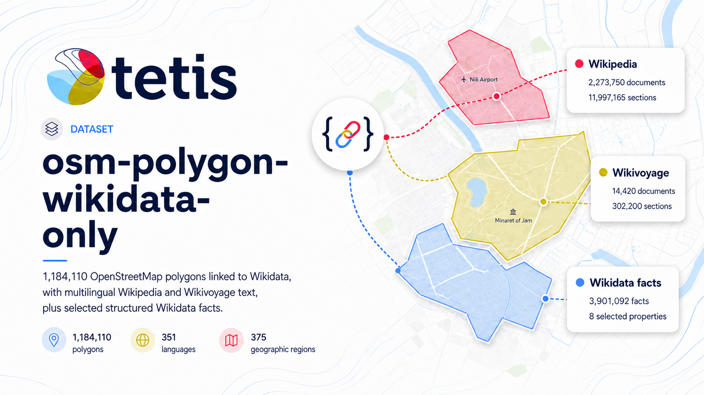

# OSM Polygon Wikidata Only

This project extracts polygonal OpenStreetMap features from Geofabrik extracts. It adds Wikidata, Wikipedia, and Wikivoyage data to the features. It writes regional Parquet datasets.

The source repository, the Python package, and the CLI keep the historical name `osm-polygon-wikidata-only`. V1 is the default. V2 is opt-in. V2 also includes the valid multilingual `wikipedia=*` tags. This includes the features that have no Wikidata QID. The project publishes V2 separately as `osm-polygon-wikidata-and-wikipedia`.

[V1 dataset card](https://huggingface.co/datasets/NoeFlandre/osm-polygon-wikidata-only) ·
[V2 dataset card](https://huggingface.co/datasets/NoeFlandre/osm-polygon-wikidata-and-wikipedia) ·
[Documentation site](https://noeflandre.github.io/osm-polygon-wikidata-only/)

## Quick start

Install Python 3.12 or newer and [uv](https://docs.astral.sh/uv/). Then install the locked environment:

```bash
git clone https://github.com/NoeFlandre/osm-polygon-wikidata-only.git
cd osm-polygon-wikidata-only
uv sync --frozen
```

Download the small [Geofabrik Monaco extract](https://download.geofabrik.de/europe/monaco.html). Process a maximum of 100 polygons. Keep the data root outside the source checkout. These commands write on the local disk. They do not upload to Hugging Face:

```bash
DATA_ROOT=../osm-polygon-data
mkdir -p "$DATA_ROOT/raw"
curl --fail --location \
  --output "$DATA_ROOT/raw/monaco-latest.osm.pbf" \
  "https://download.geofabrik.de/europe/monaco-latest.osm.pbf"
uv run osm-polygon-wikidata-only process-pbf \
  "$DATA_ROOT/raw/monaco-latest.osm.pbf" \
  --data-root "$DATA_ROOT" --limit 100 --no-full-text
```

The download and the Wikidata and Wikipedia enrichment use the network. An upload is opt-in with `--push`.

## Outputs and schema

The pipeline writes the V1 files below `<data-root>/processed/`. Each region has these files:

| Path | Contents |
| --- | --- |
| `polygons/<stem>.parquet` | The polygon identity, OSM tags, geometry, area, and coverage fields. |
| `wikipedia/documents/<stem>.parquet` | The Wikipedia documents and the revision metadata. |
| `polygon_articles/<stem>.parquet` | The links from polygons to Wikipedia and Wikivoyage documents. |
| `manifests/processed_pbfs.json` | The inventory of source PBFs and the aggregate counts. |

Augmentation adds the Wikipedia and Wikivoyage section tables and the Wikidata facts. V2 uses the separate tree `<data-root>/processed_v2/`. It uses `polygon_document_links/<stem>.parquet` for links with source provenance. The [architecture guide](docs/architecture.md) and each dataset card describe the detailed schemas and the V1 and V2 contracts.



## Configuration and Docker

Set `OSM_POLYGON_DATA_ROOT` or use `--data-root`. The directory must exist. It must stay outside the source checkout. Use `HF_TOKEN` only for an explicit upload to the Hub. Prefer the `HF_TOKEN` environment variable or a saved `hf auth login` over `--hf-token`, because a token passed on the command line appears in `ps` output and in shell history. Keep the credentials in an untracked `.env` file. Never put them in source control.

The Compose service `pipeline` builds the non-root `runtime` target. It mounts the data root at `/data`. Its default command is `--help`:

```bash
cp .env.example .env
mkdir -p ../osm-polygon-data/raw
docker compose run --rm pipeline --help
docker compose run --rm pipeline sync-dir /data/raw --data-root /data --skip-existing
```

The second command writes on the local disk. Add `--push` only when you want to publish. At runtime, Compose passes `HF_TOKEN` from the untracked `.env` file. For a direct `docker run`, use `--env-file .env`. Never put the token in a Dockerfile or in an image. For the host UID/GID mapping and the bind-mount permissions, see the [Docker guide](docs/development.md#docker-compose-runtime).

## Documentation

[Architecture](docs/architecture.md) ·
[Python API](docs/api.md) ·
[CLI reference](docs/cli-reference.md) ·
[Development and Docker](docs/development.md) ·
[Dataset snapshots](docs/dataset-snapshot.md) ·
[Glossary](docs/glossary.md) ·
[Contributing](CONTRIBUTING.md) · [Security](SECURITY.md)

## Citation

To cite the software, use [`CITATION.cff`](CITATION.cff). To cite a dataset, use its versioned metadata file: [V1 citation](docs/citations/osm-polygon-wikidata-only.cff) or [V2 citation](docs/citations/osm-polygon-wikidata-and-wikipedia.cff).

## License

The software has the [Apache-2.0](LICENSE) license. The dataset content has different terms for each source:

- [OpenStreetMap data](https://www.openstreetmap.org/copyright) has the [ODbL 1.0](https://opendatacommons.org/licenses/odbl/1-0/) license.
- [Wikidata structured data](https://www.wikidata.org/wiki/Wikidata:Licensing) has the [CC0 1.0](https://creativecommons.org/publicdomain/zero/1.0/) license.
- Wikipedia text is generally available under [CC BY-SA 4.0](https://creativecommons.org/licenses/by-sa/4.0/) or GFDL. See the [Wikimedia Terms of Use](https://foundation.wikimedia.org/wiki/Terms_of_Use).
- The written contributions to Wikivoyage use CC BY-SA 4.0, a compatible license, or the public domain. See the [Wikivoyage copyleft policy](https://en.wikivoyage.org/wiki/Wikivoyage:Copyleft).

The published document rows keep fields for the license and attribution of their source. Read these fields for the terms of each article.
