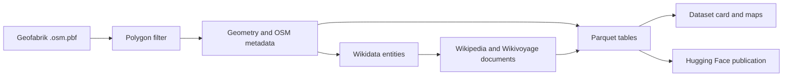

# Architecture

The project is a batch pipeline with explicit boundaries between source data,
enrichment services, local tables, and publication. The boundaries make the
dataset reproducible and let each phase be tested with small fixtures.

## Data flow

For V1, the filter keeps closed ways and multipolygon relations with a
non-empty `wikidata=*` tag. Geometry is converted to deterministic centroid,
area, bounding-box, and primary-tag fields. QIDs are deduplicated before
Wikidata requests; selected sitelinks are then fetched once per language and
revision. Rows are written in deterministic order and are not published until
the expected enrichment has completed.

## Package responsibilities

| Package | Responsibility |
| --- | --- |
| `config` | Immutable settings and validation of the external data root. |
| `domain` | IDs, geometry, filtering, row models, and Parquet schemas. |
| `io` | Streaming PBF input, atomic files, manifests, and Parquet persistence. |
| `enrichment` | Wikidata, Wikipedia, and Wikivoyage clients, parsing, and pacing. |
| `pipeline` | Extraction, enrichment, row construction, manifests, and orchestration. |
| `augmentation` | Optional text sections, Wikivoyage documents, and Wikidata facts. |
| `v2` | The isolated direct-Wikipedia-tag contract and its publication path. |
| `hf` | Dataset cards, statistics, maps, Trackio snapshots, and Hub uploads. |
| `cli` | Argument parsing and dependency wiring for the supported commands. |

The public Python facades are listed in the [API reference](api.md). Focused
implementation modules are deliberately not part of that compatibility
surface.

## V1 and V2 contracts

V1 is the default workflow and publishes to
`NoeFlandre/osm-polygon-wikidata-only`. Its polygon table is Wikidata-first;
the relationship table joins polygons to versioned Wikipedia and Wikivoyage
documents.

V2 is selected only with `sync-dir --dataset-version v2` and publishes to
`NoeFlandre/osm-polygon-wikidata-and-wikipedia`. It scans the same source PBFs
for valid multilingual `wikipedia=*` tags, reuses matching V1 documents when
possible, and fetches only direct pages that are not already represented. A
direct page can have a null Wikidata QID. V2 uses its own polygon and link
schemas and does not rewrite V1 tables.

Both contracts preserve source provenance. A link identifies its project and
document revision, while document rows keep license and attribution fields.
This keeps the many-to-many relationship unambiguous when one place has
several language versions or both Wikimedia projects.

## Local tables and manifests

Every completed region has a stable stem and contributes the following logical
tables:

- `polygons/<stem>.parquet` — one row per selected polygon;
- `wikipedia/documents/<stem>.parquet` — one row per unique Wikipedia
  document revision;
- `polygon_articles/<stem>.parquet` — polygon-to-document links for both
  projects;
- optional section, Wikivoyage, and Wikidata-fact tables produced by
  augmentation; and
- `manifests/processed_pbfs.json` — source names, row counts, and aggregate
  coverage statistics.

The exact column descriptions are generated into each Hugging Face dataset
card. Parquet schemas and manifest names are compatibility contracts; a
schema change requires an explicit dataset-version decision.

## Resumability and publication

The command-line workflows are designed to be safe to stop and restart. They
write intermediate state only inside the operator-selected data root, validate
inputs before reusing it, and keep incomplete regions out of the published
tables. A second run with `--skip-existing` skips completed local processing;
remote reconciliation, augmentation, and publication-repair actions may still
run. Unfinished work is retried from the last valid boundary.

Publication is fail-closed. A region is finalized locally only after its
Parquet files and manifest entry pass schema and join checks. With `--push`,
the region files and metadata are sent in an atomic Hugging Face commit. A
failed upload leaves local results available for a later retry and never turns
an incomplete region into a published one.

## Wikimedia requests

Wikimedia clients share one scheduler. It applies a client-side request ceiling,
per-host pacing, bounded concurrency, retries with backoff, and `429` cooldowns.
Anonymous and Bot Password sessions use different conservative ceilings; the
ceiling is a client preference, not a promise from Wikimedia. Repeated QIDs and
article titles are fetched once per run and reused for every matching polygon.

Long enrichment stages emit a two-minute heartbeat with completed QIDs,
Wikipedia sites, and articles attempted. The heartbeat is a liveness signal,
not an ETA, and it does not change request ordering or request pacing. The tracked
tests use in-memory clients, so they do not contact Wikimedia.

## Geographic coverage and derived assets

Augmentation adds section-level Wikipedia and Wikivoyage text and structured
Wikidata facts after a region's core tables are complete. Existing document
revisions are reused; new sections are fetched only when required. The same
join checks apply before a region is finalized.

Successful publication can regenerate three public geographic assets:
`assets/geographic_text_presence.png` for text presence,
`assets/coverage_map.png` for all-polygon coverage, and
`assets/geographic_text_density.png` for combined Wikipedia/Wikivoyage text
density. The maps use deterministic H3 aggregation and count a polygon once
even when multiple documents qualify. Text-density colours use a logarithmic
scale so sparse and dense cells remain visible. The generated dataset card
recomputes core and
augmentation statistics from finalized tables before publication. The static
`final-dataset-snapshot` Trackio run records headline dataset metrics and
exactly three plots; it is a snapshot, not a processing timeline.

## Container boundary

The Docker `build` has `development` and `runtime` stages. The runtime image
contains the installed application and locked dependencies, runs as a
non-root user, and defaults to `--help`. Operators must mount a data root
explicitly before running `sync-dir /data/raw --data-root /data`; source PBFs
are mounted read-only by the provided `just docker-run` recipe. Credentials are
passed at runtime and are never copied into image layers.

## Compatibility and verification

The CLI options, supported Python facades, Parquet schemas, manifest paths,
deterministic ordering, and public dataset URLs are the compatibility surface.
Run the [development quality gate](development.md) before changing any of
these boundaries. The strict MkDocs build and the Pages workflow are also
checked in CI, so a broken link or missing navigation target fails before
publication.
