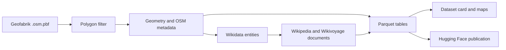

# Architecture

The project is a batch pipeline. It has explicit boundaries between the source data, the enrichment services, the local tables, and the publication. The boundaries make the dataset reproducible. They let you test each phase with small fixtures.

## Data flow

```mermaid
flowchart LR
    PBF[Geofabrik .osm.pbf] --> Filter[Polygon filter]
    Filter --> Geometry[Geometry and OSM metadata]
    Geometry --> Wikidata[Wikidata entities]
    Wikidata --> Wikipedia[Wikipedia and Wikivoyage documents]
    Geometry --> Tables[Parquet tables]
    Wikipedia --> Tables
    Tables --> Card[Dataset card and maps]
    Tables --> Hub[Hugging Face publication]
```

For V1, the filter keeps the closed ways and the multipolygon relations that have a `wikidata=*` tag that is not empty. The pipeline converts the geometry to deterministic fields: centroid, area, bounding box, and primary tag. It removes duplicate QIDs before it makes the Wikidata requests. Then it fetches the selected sitelinks once for each language and revision. It writes the rows in deterministic order. It does not publish the rows until the expected enrichment is complete.

## Package responsibilities

| Package | Responsibility |
| --- | --- |
| `config` | The immutable settings and the validation of the external data root. |
| `domain` | The IDs, geometry, filtering, row models, and Parquet schemas. |
| `io` | The streaming PBF input, atomic files, manifests, and Parquet persistence. |
| `enrichment` | The Wikidata, Wikipedia, and Wikivoyage clients, the parsing, and the pacing. |
| `pipeline` | The extraction, enrichment, row construction, manifests, and orchestration. |
| `augmentation` | The optional text sections, Wikivoyage documents, and Wikidata facts. |
| `v2` | The isolated contract for the direct Wikipedia tag, the sentence sidecars, and the publication path. |
| `hf` | The dataset cards, statistics, maps, Trackio snapshots, and Hub uploads. |
| `cli` | The argument parsing and the dependency wiring for the supported commands. |

The [API reference](api.md) lists the public Python facades. The focused implementation modules are not part of the compatibility surface. This is intentional.

## V1 and V2 contracts

V1 is the default workflow. It publishes to `NoeFlandre/osm-polygon-wikidata-only`. Its polygon table starts from Wikidata. The relationship table joins the polygons to the versioned Wikipedia and Wikivoyage documents.

Only `sync-dir --dataset-version v2` selects V2. V2 publishes to `NoeFlandre/osm-polygon-wikidata-and-wikipedia`. It scans the same source PBFs for the valid multilingual `wikipedia=*` tags. It reuses the matching V1 documents when it can. It fetches only the direct pages that the tables do not have. A direct page can have a null Wikidata QID. V2 uses its own polygon schema and link schema. It does not rewrite the V1 tables.

Both contracts keep the source provenance. A link identifies its project and its document revision. The document rows keep the license fields and the attribution fields. This keeps the many-to-many relationship unambiguous when one place has several language versions or both Wikimedia projects.

## Local tables and manifests

Each completed region has a stable stem. It contributes these logical tables:

- `polygons/<stem>.parquet`: one row for each selected polygon.
- `wikipedia/documents/<stem>.parquet`: one row for each unique Wikipedia document revision.
- `polygon_articles/<stem>.parquet`: the links from polygons to documents for both projects.
- The optional section tables, Wikivoyage tables, and Wikidata-fact tables. Augmentation produces them.
- The optional sidecars `wikipedia/sentences/<stem>.parquet` and `wikivoyage/sentences/<stem>.parquet`. The explicit [sentence-splitting stage](sentence-splitting.md) produces them.
- `manifests/processed_pbfs.json`: the source names, the row counts, and the aggregate coverage statistics.

Each Hugging Face dataset card has the generated column descriptions. The Parquet schemas and the manifest names are compatibility contracts. A schema change needs an explicit decision about the dataset version.

## Reporting identities and row semantics

Regional extracts can overlap. The same OSM object can thus be in more than one polygon file. The row-based counts keep these copies. They show the regional provenance, the storage, the links, and the document inventories. These items use one deterministic representative for each global `(osm_type, osm_id)` identity: map points, text-covered counts, language polygon counts, funnels, and card captions.

A text identity qualifies only if two conditions are true. First, the extraction of its linked document succeeded (`fetch_status=ok`). Second, its `full_text` is not empty after trimming. The optional language-split tables stay additive row-level views. They do not change these reporting semantics.

The statistics for the polygon surface and geometry stay row-based. This is intentional. The release scanner reads each row of each `polygons/<stem>.parquet` file that the manifest lists. It reads them in sorted order. It keeps the breakdown for each `source_pbf`. It writes rounded `stats.json` and card output with stable bytes. It makes them from this complete published table.

## Resumability and publication

The command-line workflows are safe to stop and restart. They write the intermediate state only inside the data root that the operator selects. They validate the inputs before they reuse the state. They keep the incomplete regions out of the published tables. A second run with `--skip-existing` skips the completed local processing. The remote reconciliation, the augmentation, and the publication-repair actions can still run. The workflow retries the unfinished work from the last valid boundary.

The publication fails closed. The pipeline finalizes a region locally only after its Parquet files and its manifest entry pass the schema checks and the join checks. With `--push`, the pipeline sends the region files and the metadata in one atomic Hugging Face commit. If an upload fails, the local results stay available for a later retry. The pipeline never changes an incomplete region to a published region.

Sentence splitting is a separate V2 stage. It reads the finalized section tables. It routes only the exact language set of SaT-3l-sm. It keeps each unsupported language as one sentence row that is not split. Each source batch has an atomic restart boundary. The source hash, the batch size, the model identifier, and the model revision identify it. The stage writes the sentence outputs and `manifests/sentence_splitting.json` only after all the source batches are complete. The [sentence-splitting guide](sentence-splitting.md) defines the schema and the routing policy.

## Wikimedia requests

The Wikimedia clients share one scheduler. The scheduler applies these controls:

- A client-side request ceiling.
- A pacing for each host.
- A bounded concurrency.
- Retries with backoff.
- Cooldowns for `429` responses.

Anonymous sessions and Bot Password sessions use different conservative ceilings. The ceiling is a preference of the client. It is not a promise from Wikimedia. The pipeline fetches repeated QIDs and article titles once in a run. It reuses them for each matching polygon.

The long enrichment stages emit a heartbeat every two minutes. The heartbeat shows the completed QIDs, the Wikipedia sites, and the articles attempted. It is a signal that the stage is alive. It is not an estimate of the time left. It does not change the request order or the request pacing. The tracked tests use in-memory clients. They do not contact Wikimedia.

## Geographic coverage and derived assets

Augmentation adds the Wikipedia and Wikivoyage text by section and the structured Wikidata facts. It does this after the core tables of a region are complete. It reuses the existing document revisions. It fetches new sections only when necessary. The same join checks apply before the pipeline finalizes a region.

A successful publication can regenerate three public geographic assets:

- `assets/geographic_text_presence.png` shows the text presence.
- `assets/coverage_map.png` shows the coverage of all polygons.
- `assets/geographic_text_density.png` shows the density of the combined Wikipedia and Wikivoyage text.

The maps use a deterministic H3 aggregation. They count a polygon once, even when more than one document qualifies. The text-density colours use a logarithmic scale. Sparse cells and dense cells thus stay visible.

Before publication, the generated dataset card recomputes the core statistics and the augmentation statistics from the finalized tables. The static Trackio run `final-dataset-snapshot` records the headline dataset metrics and exactly three plots. It is a snapshot. It is not a timeline of the processing.

## Polygon surface and geometry statistics

The publication also recomputes the statistics for the surface and geometry of the polygon table. It publishes them as `stats.json` next to the dataset card. The card has a concise summary of the same snapshot.

The snapshot uses only the published polygon table. It reads each valid row of each `polygons/<stem>.parquet` file. It does not sample. It does not truncate. It does not use an external lookup. It does not recompute from the raw PBFs. The file `manifests/processed_pbfs.json` defines the files that the dataset publishes.

These conditions stop the publication. A misleading report is thus not possible:

- A listed file is missing.
- A row count is different from the manifest.
- A Parquet file is not the polygon table.
- An `area_m2` value is not finite.
- A polygon column has a type that is not canonical.
- A manifest entry disagrees about its key, its declared `source_pbf`, and its polygon path.

The scanner reads only the columns `source_pbf`, `area_m2`, `bbox`, and `geometry`. It decodes the geometry one record batch at a time. The memory use is thus bounded. The scanner reads the files in sorted order. The pipeline rounds each published float to six decimals. Unchanged input thus produces a `stats.json` and a card block with identical bytes.

Unified sync commits the regional data first. It refreshes `stats.json`, the maps, and the README once, after the regional upload queue is empty. A processed-directory run does the same. Each PBF publishes its own region. The pipeline produces the assets for the whole repository once at the end. Both workflows keep the same statistics for the complete dataset. They do not rescan after each region. A single-PBF run still publishes these assets inline.

The deferred refresh and the reconciliation repair publish through one post-drain step. Nothing for the whole repository goes through the regional upload queue. The queue continues after a job uses all its retries. These assets thus never describe a region whose upload failed.

The deferral fails closed. These rules apply:

- The pipeline records the regions that need a refresh in a durable record. It does this before it submits their upload.
- The refresh runs only when all of these conditions are true: the regional queue is empty with no failures, the run finished its processing, and the run published each recorded region.
- In all other cases, the record stays in place and the pipeline publishes nothing for the whole repository. These cases include a failed run, an aborted run, and a rerun that skipped a region that an earlier run did not upload.

Unified sync repairs from that record. It reconciles against the remote and republishes the missing regional artifacts before it refreshes. This reconciliation is based on presence. It republishes a region whose remote files are absent. It does not republish a region whose remote files are only older than the local files. A region that is rewritten locally and not uploaded is thus repaired only when its remote objects are missing.

`stats.json` has a `contract_version`, a `source` block (`table`, `column_scope`, `file_count`, `polygon_count`), and four result blocks. These are the exact fields:

- `area_m2`: `total`, `minimum`, `maximum`, `mean`, `median`, and the percentiles `p1`, `p5`, `p25`, `p75`, `p95`, `p99` of the `area_m2` values that the table records. It also has these counts:
    - `non_positive_count`: the degenerate rows with `area_m2 <= 0`.
    - `below_one_m2_count`: the positive rows under one square metre.
    - `null_count`: the rows with no recorded area.

    The percentiles interpolate linearly between the two closest ranks.
- `area_histogram`: a fixed list of half-open log-scale buckets. Each bucket has a `label`, `lower_m2`, `upper_m2`, and `count`. The first bucket collects the degenerate areas. The last bucket is unbounded. The list is thus identical in each report.
- `geometry`: `polygon_count` and `multipolygon_count` by GeoJSON type, `unreadable_count`, `with_holes_count`, `total_rings`, `total_holes`, `total_vertices`, and the distributions `vertices`, `rings`, and `components`. `unreadable_count` counts the rows whose geometry is missing or is not a Polygon or MultiPolygon. A vertex is one coordinate pair. The count includes the repeated closing coordinate of each ring once. `components` is the number of `MultiPolygon` members. It is `1` for each `Polygon` row.
- `extent`: the `dataset_bbox` envelope, and the distributions `width_deg`, `height_deg`, `width_m`, and `height_m` of the bounding boxes of the rows. It also has `wider_than_180_deg_count` (the antimeridian signature), `pole_touching_count`, and `unreadable_count`. The metre spans use the same equirectangular rule as `area_m2`. They are evaluated at the mean latitude of each box.
- `per_source_pbf`: one entry for each source, sorted by `source_pbf`. Each entry has `polygon_count`, `total_area_m2`, `median_area_m2`, and `maximum_area_m2`.

Each distribution block reports `minimum`, `maximum`, `mean`, `median`, `p95`, and `p99`.

## Quality boundaries and deterministic replay

The quality cycle follows the same ownership boundaries as the runtime:

- The `domain` modules contain local data rules. They can depend only on the local domain layer.
- The `pipeline` modules orchestrate the local state. They must not import CLI modules. The argument parsing and the dependency wiring stay at the edge.
- The local integration tests use the real Parquet, JSON, and manifest formats. The external clients are deterministic stubs.

The AST checker inspects the project-local imports. It fails on cycles, domain-purity violations, and edges from the pipeline to the CLI. It ignores third-party imports on purpose. It is thus an architectural constraint. It does not prove that the runtime code has no side effects.

Hypothesis properties cover the sentence invariants. The pytest-bdd acceptance tests replay an interrupted local run. They compare it with a clean run. The comparison includes the rows, the offsets, the language routing, and the manifest results. [ADR 0001: Quality boundaries](adr/0001-quality-boundaries.md) records the rationale and the boundary cleanup rule.

The CRAP gate evaluates the full source files of its configured inventory. It uses the Radon mode `--show-closures`. It thus includes the nested functions. Mutation testing stays limited to deterministic helpers and quality tools. Focused integration checks or operational checks cover the live network, GPU, publication, and large-data behavior. These boundaries describe the quality design. Static checks do not prove that the runtime side effects are safe.

## Container boundary

The Docker build has separate `development` and `runtime` targets. The runtime image has the installed application and the locked dependencies. It runs as a non-root user. It has OCI labels for the source, the version, and the license. Its health check runs the version command of the local CLI. Both `docker run` and the Compose service use `--help` as the default.

The root file `compose.yaml` builds the `runtime` target. It loads a local `.env` file if one exists. It maps the host UID/GID. It bind-mounts an external data root at `/data`. The runtime receives only the container path `/data` as `OSM_POLYGON_DATA_ROOT`. The host path stays a Compose setting. The Compose service does not add publication flags. The runtime supplies the Hugging Face credentials. They never enter the image layers.

CI smoke-tests the default command with the container network off. For processing, the command is `sync-dir /data/raw --data-root /data`. The Compose bind mount keeps the source PBFs read-only. It stores the output and the restart state under `/data`.

## Compatibility and verification

The compatibility surface has these items: the CLI options, the supported Python facades, the Parquet schemas, the manifest paths, the deterministic ordering, and the public dataset URLs. Before you change one of these boundaries, run the [development quality gate](development.md). CI also checks the strict MkDocs build and the Pages workflow. A broken link or a missing navigation target thus fails before publication.
