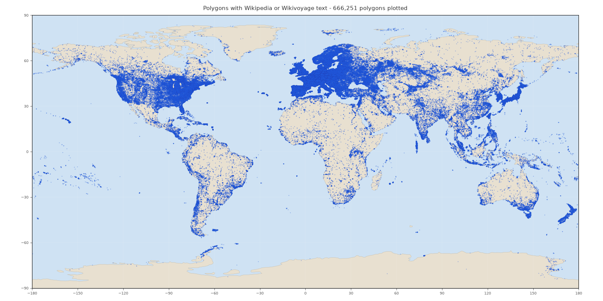
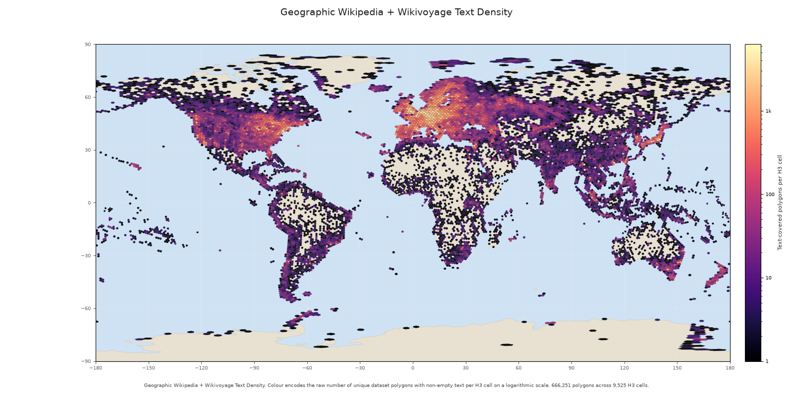

# Wordlwide OSM polygons with linked knowledge

<p class="kicker">Dataset overview</p>

<div class="rule"></div>

<p>Wikidata connects real places in OpenStreetMap to multilingual Wikipedia and Wikivoyage text.</p>
<p>Snapshot: 2026-08-02</p>

<!-- notes: [Sources] Generated from the local processed Parquet snapshot, processed_pbfs.json, and the project README. Colloquium workflow: https://pypi.org/project/colloquium/0.2.2/ -->

---

<!-- layout: title-left -->
## Every row starts with a real OSM polygon

<p class="lead">The pipeline reads Geofabrik extracts and keeps closed ways and multipolygon relations with a non-empty <code>wikidata=*</code> tag.</p>

- <strong>1,184,110</strong> polygon rows across <strong>375</strong> active regions
- each polygon keeps its OSM identity, geometry, tags, centroid, and area
- the raw input set has 386 PBFs; 11 contained extracts are retired from the active set

<p class="callout">This is a place-first dataset. Text and facts are linked to the polygon through its Wikidata Q-id.</p>

<!-- notes: [Sources] Project README, domain schemas, and processed_pbfs.json. Selection is implemented in src/osm_polygon_wikidata_only/domain/filters.py and io/pbf_reader.py. -->

---

<!-- layout: content -->
## Seven Parquet tables form one linked dataset

<table class="table-lg">
<thead>
<tr><th>Table</th><th>What it contains</th></tr>
</thead>
<tbody>
<tr><td><code>polygons</code></td><td>One row per selected OSM polygon</td></tr>
<tr><td><code>polygon_articles</code></td><td>One link row per polygon and Wikipedia or Wikivoyage document</td></tr>
<tr><td><code>wikipedia/documents</code></td><td>Full Wikipedia document rows</td></tr>
<tr><td><code>wikipedia/sections</code></td><td>Section-level Wikipedia text</td></tr>
<tr><td><code>wikivoyage/documents</code></td><td>Full Wikivoyage document rows</td></tr>
<tr><td><code>wikivoyage/sections</code></td><td>Section-level Wikivoyage text</td></tr>
<tr><td><code>wikidata/facts</code></td><td>Selected structured Wikidata claims</td></tr>
</tbody>
</table>

<p class="small">Every table is partitioned by the Geofabrik stem. The link table has a <code>project</code> column so one join works for both text sources.</p>

<!-- notes: [Sources] Generated dataset card schema section and src/osm_polygon_wikidata_only/hf/repo_layout.py. The link contract is defined in domain/polygon_document_links.py. -->

---

<!-- layout: title-left -->
## Wikidata is the bridge between geometry and text

<p class="flow"><strong>OSM polygon</strong> &nbsp; → &nbsp; <strong>Wikidata Q-id</strong> &nbsp; → &nbsp; <strong>Wikipedia documents</strong></p>
<p class="flow"><strong>OSM polygon</strong> &nbsp; → &nbsp; <strong>Wikidata Q-id</strong> &nbsp; → &nbsp; <strong>Wikivoyage documents</strong></p>
<p class="flow"><strong>Wikidata Q-id</strong> &nbsp; → &nbsp; <strong>facts table</strong></p>

<p class="lead">A document can be linked to several polygons. A polygon can have documents in many languages and in both projects.</p>

<ul class="tight">
  <li><code>document_id</code> identifies a page revision.</li>
  <li><code>project</code> distinguishes Wikipedia from Wikivoyage.</li>
  <li>Sections reference their parent document, so full text and section text can be used together.</li>
</ul>

<!-- notes: [Sources] Project README schema sections and the canonical link schema in domain/polygon_document_links.py. -->

---

<!-- layout: content -->
## The snapshot has broad coverage, with a clear text boundary

<!-- columns: 2 -->
<p class="callout"><strong>Core scale</strong><br>1,119,223 unique Wikidata entities<br>2,273,750 Wikipedia documents<br>14,420 Wikivoyage documents</p>

|||

<p class="callout"><strong>Derived text and facts</strong><br>11,997,165 Wikipedia sections<br>302,200 Wikivoyage sections<br>3,901,092 Wikidata facts</p>

<p class="lead">666,251 polygons have at least one non-empty Wikipedia or Wikivoyage document, or 56.3% of the polygon set.</p>
<p class="small">Document words count full document rows. Section rows are excluded because they repeat document text.</p>

<!-- notes: [Sources] Generated dataset card snapshot table and coverage map inputs. Counts are read from the current local card generated by the pipeline. -->

---

<!-- layout: content -->
## Text coverage is strongest in Europe, but not uniform

| Continent | Polygons | Wikipedia text | Wikipedia + Voyage | Coverage |
| --- | ---: | ---: | ---: | ---: |
| Africa | 11,289 | 8,309 | 8,309 | 73.6% |
| Antarctica | 254 | 251 | 251 | 98.8% |
| Asia | 117,610 | 94,924 | 94,945 | 80.7% |
| Europe | 792,569 | 373,782 | 373,782 | 47.2% |
| North America | 162,012 | 120,166 | 120,167 | 74.2% |
| Oceania | 19,807 | 11,467 | 11,468 | 57.9% |
| South America | 18,906 | 13,503 | 13,503 | 71.4% |
| Unassigned | 61,663 | 43,824 | 43,826 | 71.1% |

<p class="small">A polygon is assigned by its WGS84 centroid and Natural Earth country boundaries. Offshore or unmatched centroids stay <code>Unassigned</code>. Coverage is text-covered polygons divided by polygons in that row.</p>

<!-- notes: [Sources] Generated geographic distribution table from the dataset card snapshot. Method and caveats are documented in src/osm_polygon_wikidata_only/hf/continent_stats.py and the README. -->

---

<!-- layout: content -->
## Languages show a long tail

<!-- columns: 2 -->
<h3>Top document languages</h3>

| Language | Documents | Share |
| --- | ---: | ---: |
| `en` | 223,301 | 10.1% |
| `de` | 146,312 | 6.6% |
| `fr` | 109,720 | 5.0% |
| `ceb` | 105,479 | 4.8% |
| `sv` | 74,518 | 3.4% |
| `ru` | 73,228 | 3.3% |
| `es` | 70,808 | 3.2% |
| `it` | 65,927 | 3.0% |

|||

<h3>What the distribution means</h3>
<ul class="tight">
  <li><strong>351</strong> languages occur across both projects.</li>
  <li>The top five languages account for 29.9% of all documents.</li>
  <li>The top twenty account for 63.6%.</li>
  <li>Language counts describe document rows.</li>
</ul>

<!-- notes: [Sources] Generated language table and concentration values from the dataset card snapshot. Language definitions are in hf/dataset_stats.py and hf/continent_stats.py. -->

---

<!-- layout: content -->
## Two maps answer two different geographic questions

<!-- columns: 2 -->


<p><strong>All polygons.</strong> Each point is an OSM polygon carrying a Wikidata tag.</p>

|||



<p><strong>Polygons with text.</strong> Each point has non-empty Wikipedia or Wikivoyage text.</p>

<!-- notes: [Sources] Maps are generated by hf/coverage_map.py, hf/geographic_text_presence.py, and hf/geographic_text_density.py. Natural Earth is used for land context. -->

---

<!-- layout: content -->
## H3 density shows where text-covered places cluster



<p class="map-caption">Each H3 cell contains the number of unique polygons with non-empty Wikipedia or Wikivoyage text. A polygon is counted once even if it has several documents.</p>

<!-- notes: [Sources] Generated by hf/geographic_text_density.py from local Parquet tables. H3 resolution and low-sample rules are defined in hf/_geographic/h3_geometry.py. -->

---

<!-- layout: title-left -->
## A reproducible snapshot that is ready to use

<ul>
  <li>Parquet files are partitioned by region and can be loaded with Hugging Face Datasets or PyArrow.</li>
  <li>Text is plain text with page and revision identifiers, license, and attribution fields.</li>
  <li>Source licenses are explicit: ODbL for OpenStreetMap, CC0 for Wikidata, and CC BY-SA 4.0 for Wikipedia and Wikivoyage.</li>
</ul>

```python
from datasets import load_dataset
ds = load_dataset(
    "parquet",
    data_files={"polygons": "hf://datasets/NoeFlandre/osm-polygon-wikidata-only/polygons/*.parquet"},
)
```

<p><a href="https://huggingface.co/datasets/NoeFlandre/osm-polygon-wikidata-only">Open the dataset on Hugging Face</a></p>

<!-- notes: [Sources] Project README data-loading and license sections. Hugging Face dataset URL: https://huggingface.co/datasets/NoeFlandre/osm-polygon-wikidata-only. -->

---

<!-- layout: title-left -->
## The dataset grows through a resumable pipeline

<p class="lead">Each run reads new or changed PBFs, enriches only the regions that need work, writes atomic Parquet artifacts, refreshes the generated card and maps, then publishes one coherent Hub update.</p>

<div class="callout"><p>Use the codebase deck to see how the pipeline keeps that snapshot deterministic and recoverable.</p></div>

<p><a href="https://github.com/NoeFlandre/osm-polygon-wikidata-only">Source code on GitHub</a></p>

<!-- notes: [Sources] Project README, docs/architecture.md, and pipeline publication modules. Public links: https://github.com/NoeFlandre/osm-polygon-wikidata-only and https://huggingface.co/datasets/NoeFlandre/osm-polygon-wikidata-only. -->
